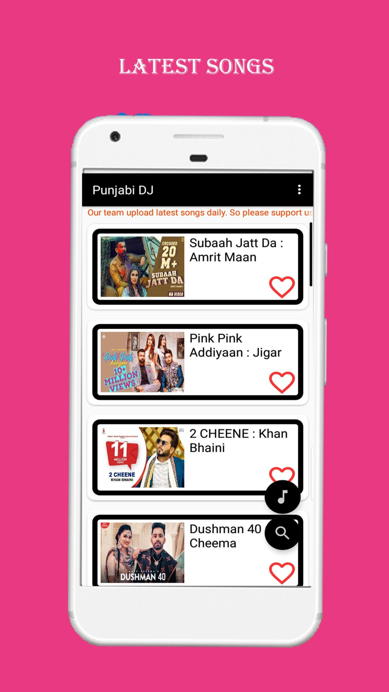
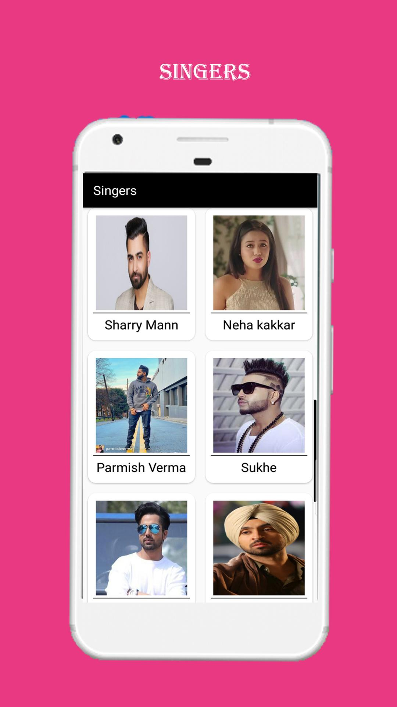
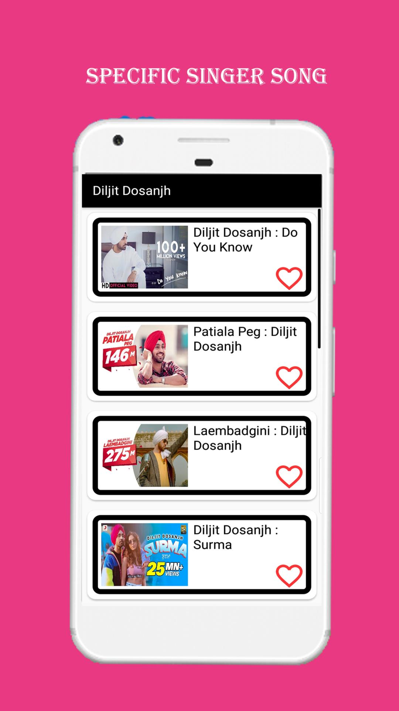
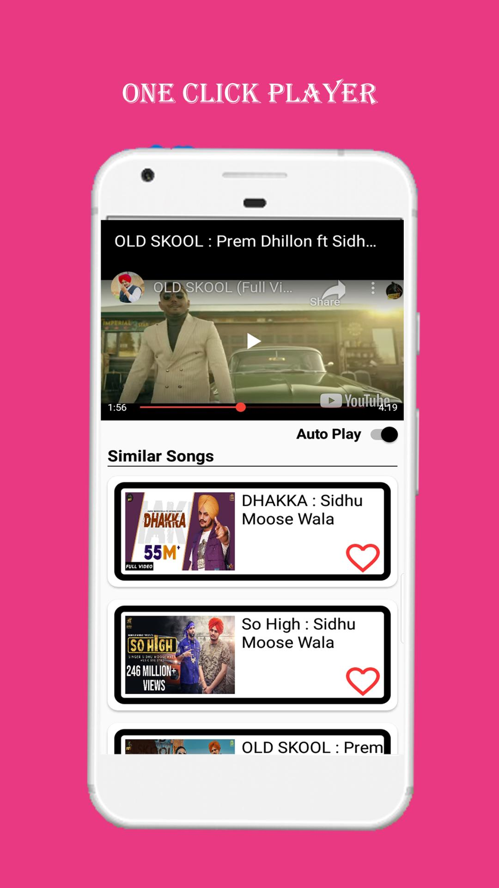
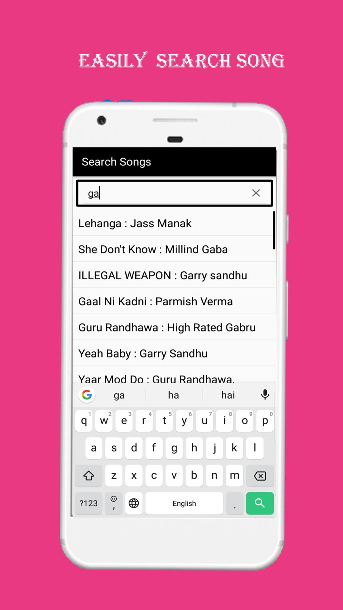
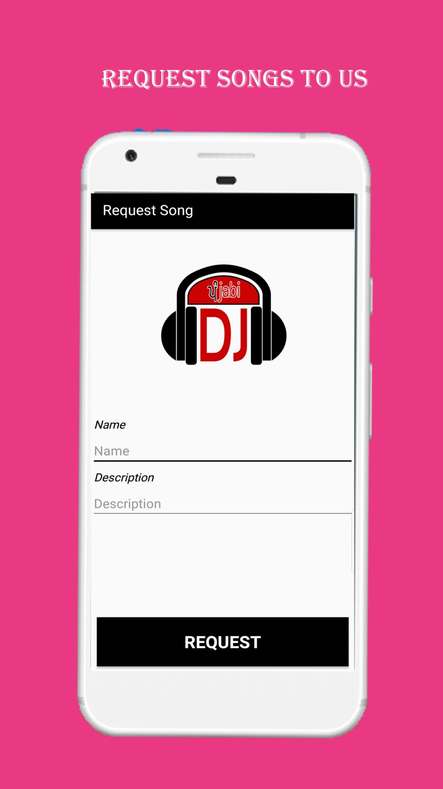

# Project Title

Punjabi DJ - Android Music Application

## Overview

Punjabi DJ is a feature-rich Android music application that serves as a platform for the latest Punjabi songs. With a vast collection, personalized playlists, and user-friendly features, it offers an immersive music experience for Punjabi music enthusiasts.

## Features

- **Great Searching Facility**: Intuitive search functionality for easy song discovery.
  
- **Latest Songs at Main Page**: Stay updated with the newest Punjabi tracks showcased prominently.

- **Songs Categorized by Singer**: Organized browsing by your favorite Punjabi singers.

- **Store Songs at Different Sections**: Explore diverse sections for mood-based or genre-specific songs.

- **Auto Play Feature**: Seamless listening experience with the auto-play feature.

- **Optimized APK Size**: Efficient storage usage with an APK file under 4MB.

- **Favorite Section**: Personalized playlist creation with a dedicated "Favorites" section.

## Technologies Used

### Frontend

- **Android Architecture**
- **Java**
- **XML**

### Backend

- **PHP**
- **MySQL**

### Development Platforms

- **Frontend Platform**: Android Studio
- **Backend Platforms**: cPanel, PHPMyAdmin

## Getting Started

1. Clone the repository: `https://github.com/Rhmarwaha/PUNJABI_DJ.git`
2. Open the project in Android Studio.
3. Set up the backend using cPanel and PHPMyAdmin.

## License

This project is licensed under the [MIT License](LICENSE). Feel free to use, modify, and distribute the code as per the license terms.

Enjoy the best of Punjabi music with Punjabi DJ!

## Screenshots

*Caption: The main page displaying the latest Punjabi songs.*

*Caption: Search and discover your favorite Punjabi tracks effortlessly.*

*Caption: Organized sections for different categories of Punjabi songs.*

*Caption: Auto-play feature for a seamless listening experience.*

*Caption: Easy Search Of Song From Hundred of Songs*

*Caption: Request Song From the User*

*Caption: Favourite Section*
